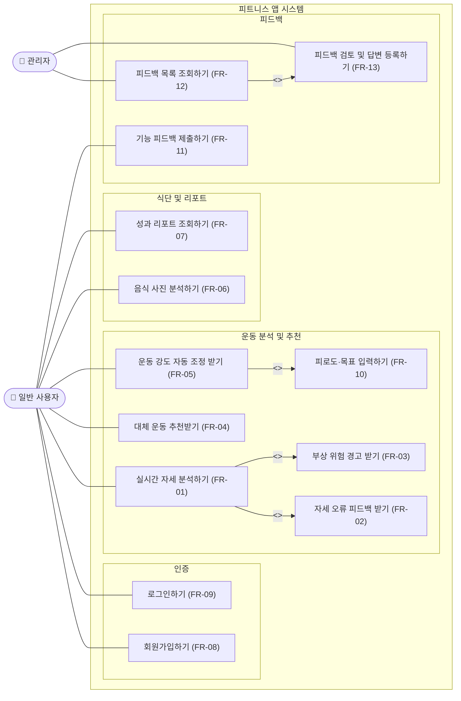

## 유스케이스 다이어그램

```mermaid
flowchart LR
  User(["👤 일반 사용자"])
  Admin(["👤 관리자"])

  subgraph SYS ["피트니스 앱 시스템"]
    direction TB

    subgraph AUTH ["인증"]
      UC08["회원가입하기 (FR-08)"]
      UC09["로그인하기 (FR-09)"]
    end

    subgraph EXERCISE ["운동 분석 및 추천"]
      UC01["실시간 자세 분석하기 (FR-01)"]
      UC02["자세 오류 피드백 받기 (FR-02)"]
      UC03["부상 위험 경고 받기 (FR-03)"]
      UC10["피로도·목표 입력하기 (FR-10)"]
      UC04["대체 운동 추천받기 (FR-04)"]
      UC05["운동 강도 자동 조정 받기 (FR-05)"]
    end

    subgraph HEALTH ["식단 및 리포트"]
      UC06["음식 사진 분석하기 (FR-06)"]
      UC07["성과 리포트 조회하기 (FR-07)"]
    end

    subgraph FEEDBACK ["피드백"]
      UC11["기능 피드백 제출하기 (FR-11)"]
      UC12["피드백 목록 조회하기 (FR-12)"]
      UC13["피드백 검토 및 답변 등록하기 (FR-13)"]
    end

    UC01 -- "<>" --> UC02
    UC01 -- "<>" --> UC03
    UC05 -- "<>" --> UC10
    UC12 -- "<>" --> UC13
  end

  User --- UC08
  User --- UC09
  User --- UC01
  User --- UC04
  User --- UC05
  User --- UC06
  User --- UC07
  User --- UC11

  Admin --- UC12
  Admin --- UC13
```
