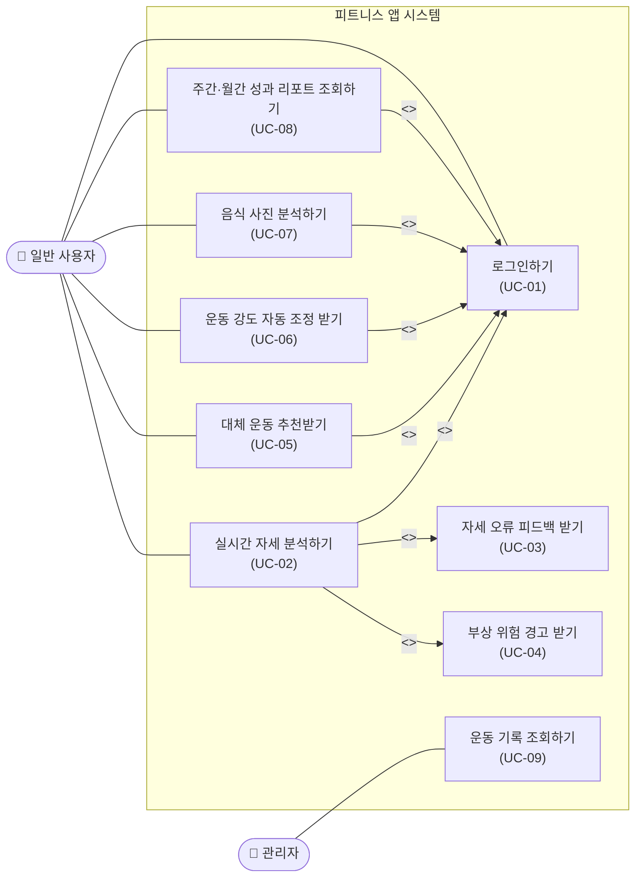

## 유스케이스 다이어그램

```mermaid
flowchart LR
  %% 액터
  User(["👤 일반 사용자"])
  Admin(["👤 관리자"])

  subgraph SYS ["피트니스 앱 시스템"]
    direction TB

    UC01["로그인하기\n(UC-01)"]
    UC02["실시간 자세 분석하기\n(UC-02)"]
    UC03["자세 오류 피드백 받기\n(UC-03)"]
    UC04["부상 위험 경고 받기\n(UC-04)"]
    UC05["대체 운동 추천받기\n(UC-05)"]
    UC06["운동 강도 자동 조정 받기\n(UC-06)"]
    UC07["음식 사진 분석하기\n(UC-07)"]
    UC08["주간·월간 성과 리포트 조회하기\n(UC-08)"]
    UC09["운동 기록 조회하기\n(UC-09)"]

    UC02 -- "<>" --> UC01
    UC05 -- "<>" --> UC01
    UC06 -- "<>" --> UC01
    UC07 -- "<>" --> UC01
    UC08 -- "<>" --> UC01

    UC02 -- "<>" --> UC03
    UC02 -- "<>" --> UC04
  end

  User --- UC01
  User --- UC02
  User --- UC05
  User --- UC06
  User --- UC07
  User --- UC08
  Admin --- UC09
```
