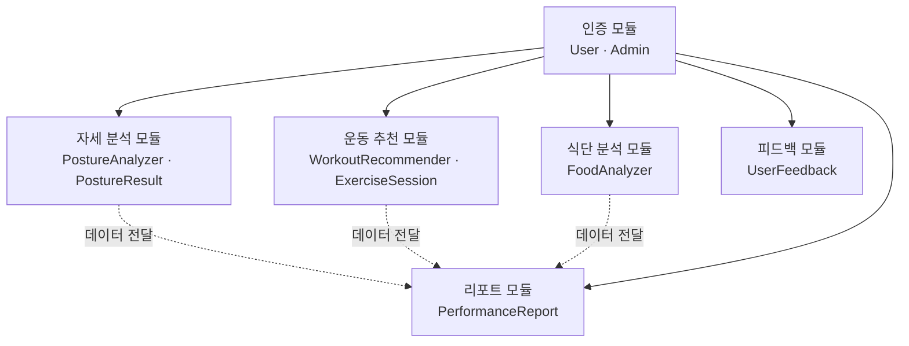

# 모듈 설계서

## 모듈 구조도

---

## 모듈 명세

### 1. 인증 모듈

| 항목 | 내용 |
|------|------|
| 포함 클래스 | `User`, `Admin` |
| 담당 FR | FR-08, FR-09 |
| 입력 | 이메일, 비밀번호 |
| 출력 | 로그인 성공/실패, 세션 토큰 |
| 주요 기능 | 회원가입, 로그인, 사용자·관리자 역할 구분 |
| 의존 관계 | 없음 (최상위 모듈) |

---

### 2. 자세 분석 모듈

| 항목 | 내용 |
|------|------|
| 포함 클래스 | `PostureAnalyzer`, `PostureResult` |
| 담당 FR | FR-01, FR-02, FR-03 |
| 입력 | 카메라 프레임 (초당 5회 이상) |
| 출력 | 자세 분석 결과, 오류 피드백 메시지, 부상 위험 경고 |
| 주요 기능 | 실시간 관절 각도 분석, 자세 오류 감지, 부상 위험 경고 |
| 의존 관계 | 인증 모듈 (로그인 후 사용 가능), 리포트 모듈에 결과 전달 |

---

### 3. 운동 추천 모듈

| 항목 | 내용 |
|------|------|
| 포함 클래스 | `WorkoutRecommender`, `ExerciseSession` |
| 담당 FR | FR-04, FR-05, FR-10 |
| 입력 | 피로도, 운동 목표, 최근 운동 기록, 운동 환경 정보 |
| 출력 | 대체 운동 목록 (최소 3개), 조정된 운동 강도·반복수·중량 |
| 주요 기능 | 대체 운동 추천, 운동 강도 자동 조정, 운동 세션 기록 |
| 의존 관계 | 인증 모듈, 리포트 모듈에 세션 데이터 전달 |

---

### 4. 식단 분석 모듈

| 항목 | 내용 |
|------|------|
| 포함 클래스 | `FoodAnalyzer` |
| 담당 FR | FR-06 |
| 입력 | 음식 사진 이미지 |
| 출력 | 음식 종류, 예상 칼로리, 주요 영양소 (5초 이내) |
| 주요 기능 | 음식 사진 분석, 칼로리 추정, 영양소 정보 제공 |
| 의존 관계 | 인증 모듈, 리포트 모듈에 식단 데이터 전달 |

---

### 5. 리포트 모듈

| 항목 | 내용 |
|------|------|
| 포함 클래스 | `PerformanceReport` |
| 담당 FR | FR-07 |
| 입력 | 운동 세션 기록, 자세 분석 결과, 식단 칼로리·영양소 데이터 |
| 출력 | 주간·월간 성과 리포트, 그래프 시각화 데이터 |
| 주요 기능 | 기간별 데이터 집계, 운동 수행도 및 영양 섭취 상태 시각화 |
| 의존 관계 | 인증 모듈, 자세 분석·운동 추천·식단 분석 모듈로부터 데이터 수신 |

---

### 6. 피드백 모듈

| 항목 | 내용 |
|------|------|
| 포함 클래스 | `UserFeedback` |
| 담당 FR | FR-11, FR-12, FR-13 |
| 입력 | 사용자 피드백 내용, 관리자 검토 결과 및 답변 |
| 출력 | 제출된 피드백 목록, 처리 상태, 관리자 답변 |
| 주요 기능 | 피드백 제출, 피드백 목록 조회, 처리 상태 변경 및 답변 등록 |
| 의존 관계 | 인증 모듈 (사용자·관리자 역할 구분 필요) |

---

*최종 수정: 2026-06-01 | 담당: 팀장*
